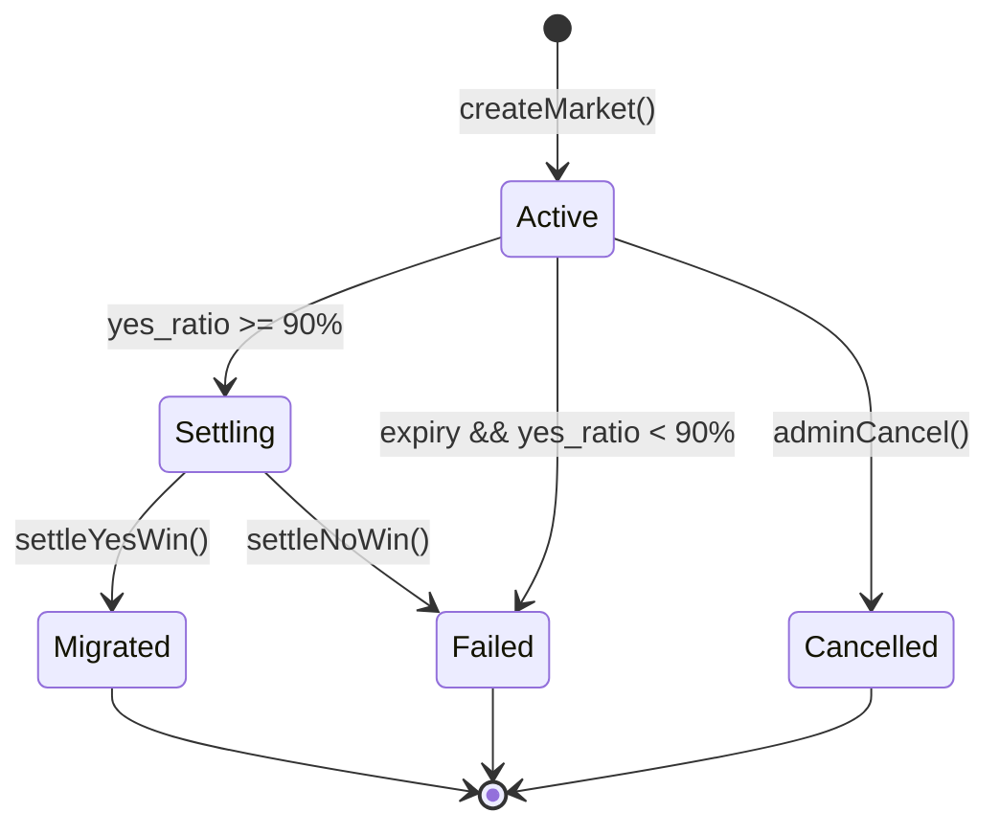

# Polyfun 开发文档

> **Prediction Launchpad** — 将 Pump.fun 联合曲线发射机制与 Polymarket 二元预测市场结合的 Web3 发射台

| 项目 | 说明 |
|------|------|
| 项目名称 | **polyfun** |
| 链 | **Base** Mainnet（生产）/ **Base Sepolia**（开发测试） |
| Chain ID | 8453（Mainnet）/ 84532（Sepolia） |
| 外盘 DEX | Uniswap V3 / Aerodrome |
| 平台币 | **POLYFUN**（ERC-20） |
| Token 尾缀 | 所有平台发行 Token 必须以 **`ba5e`** 结尾（见 [§6.9](#69-create2-与-ba5e-地址尾缀)） |
| 文档版本 | v0.7.1 |
| 最后更新 | 2026-05-23 |

---

## 目录

1. [项目概述](#1-项目概述)
2. [术语表](#2-术语表)
3. [核心机制](#3-核心机制)
4. [生命周期与状态机](#4-生命周期与状态机)
5. [资金与代币经济模型](#5-资金与代币经济模型)
6. [智能合约架构](#6-智能合约架构)
7. [前端架构与 UI 规范](#7-前端架构与-ui-规范)
8. [链下服务与索引](#8-链下服务与索引)
9. [接口规范](#9-接口规范)
10. [安全与风控](#10-安全与风控)
11. [测试策略](#11-测试策略)
12. [开发路线图](#12-开发路线图)
13. [仓库目录结构](#13-仓库目录结构)
14. [附录](#14-附录)

---

## 1. 项目概述

### 1.1 产品定位

Polyfun 是一个部署在 **Base** 上的 **以预测驱动的 Meme 代币发射台（Launchpad）**。平台由 **POLYFUN 平台币** 与 **唯一官方入口 PolyfunLauncher** 驱动：任何用户均可通过 Launcher 发行自己的 Meme Token，但 **所有 Token 必须经由平台工厂部署、遵循同一套预测—曲线—清算—迁移逻辑**，且合约地址尾缀统一为 **`ba5e`**（Polyfun 品牌 hex 尾字节 `0xBA5E`）。

开发者通过 Launcher 创建代币时，内盘阶段将资金池拆分为 **YES（看涨/能成功上线）** 与 **NO（看跌/发射失败）** 两种预测份额。当 YES 资金占比达到 **90% 阈值** 时，内盘瞬间锁定，触发原子化清算与外盘迁移；若倒计时结束仍未达阈值，则 NO 获胜，代币发射失败。

### 1.2 核心创新

| 创新点 | 说明 |
|--------|------|
| 官方发射台 | POLYFUN 平台币 + Launcher 唯一入口；用户一键发币，逻辑由协议强制统一 |
| **`pppp` 品牌尾缀** | 所有平台 Token 地址尾缀一致，链上校验，对标 Pump.fun 的 `...pump` |
| 挤空机制 (Short Squeeze) | NO 仓位在 YES 达 90% 时被强平，资金注入外盘 LP，形成「拉盘挤空」博弈 |
| 解决「差一步上线」死池 | 85%+ 进度时清算预期吸引资金冲刺 90%，提高内盘转外盘成功率 |
| 双重情绪杠杆 | 用户同时参与 Meme 币投机与规则明确的生存博弈 |

### 1.3 设计目标

- **原子性**：触发 90% 阈值的交易必须在同一笔 EVM 交易中完成锁定 → 清算 → 迁移
- **极简 UI**：Polymarket / 微信指数风格，突出进度条、YES/NO 按钮、倒计时
- **唯一入口**：所有 Meme Token **仅** 可通过 `PolyfunLauncher` 创建，禁止绕过工厂自行部署
- **逻辑一致**：全部市场共用同一套已审计的 Market / Token 实现（EIP-1167 Clone），Creators 不可修改曲线、阈值、清算规则
- **品牌尾缀**：平台发行的 Token 地址统一以 `pppp` 结尾，链上强制校验
- **可组合性**：合约模块化，支持 Uniswap V3 / Aerodrome 外盘适配器切换
- **可审计性**：所有状态变更链上可查，链下索引实时同步

### 1.4 平台发射台架构

```
┌─────────────────────────────────────────────────────────────────┐
│                        Polyfun 平台层                              │
│  ┌──────────────┐  ┌──────────────┐  ┌────────────────────────┐ │
│  │ POLYFUN      │  │ PolyfunConfig│  │ PolyfunRegistry        │ │
│  │ 平台币       │  │ 全局参数     │  │ 已验证 Market/Token 索引│ │
│  └──────┬───────┘  └──────┬───────┘  └───────────┬────────────┘ │
│         │                 │                      │              │
│         └─────────────────┼──────────────────────┘              │
│                           ▼                                     │
│              ┌────────────────────────┐                         │
│              │   PolyfunLauncher        │  ◄── 用户唯一创建入口   │
│              │   (createLaunch)         │                         │
│              └────────────┬───────────┘                         │
│                           │ CREATE2 + salt（pppp 尾缀）          │
│           ┌───────────────┼───────────────┐                     │
│           ▼               ▼               ▼                     │
│    PolyfunToken      PolyfunMarket    IPFS 元数据               │
│    ...pppp           (Clone)          链下索引                   │
└─────────────────────────────────────────────────────────────────┘
                           │
                           ▼
              内盘 YES/NO 博弈 → 90% 迁移 / 到期 NO 胜
```

**用户创建流程（Launch Flow）：**

1. 连接钱包 → 进入 `/launch`
2. 填写 Token 名称、符号、图片、命题描述
3. 链下 Vanity 服务预计算 CREATE2 `salt`，保证 Token 地址尾缀为 `pppp`
4. 支付 **创建费（ETH/USDC）** + 可选 **POLYFUN 质押/燃烧**（见 §5.6）
5. 调用 `PolyfunLauncher.createLaunch()`，单笔交易完成：部署 Token + Market + 注册 Registry
6. 跳转至 `/market/[address]` 开始内盘博弈

> **Creators 权限边界**：Creator 仅可设定元数据（名称、符号、图片、命题文案）与初始流动性金额；**不可**修改 `thresholdBps`、`duration`、曲线类型、费率、迁移规则——这些由 `PolyfunConfig` 统一管控。

### 1.5 Base 链选型理由

| 维度 | 说明 |
|------|------|
| **极低 Gas** | EIP-4844 升级后单笔交互约 **$0.001 级**，适合内盘高频 YES/NO 博弈 |
| **2 秒出块** | Base L2 区块时间 ~2s，倒计时与迁移窗口可精确到分钟级 |
| **Meme 生态** | Clanker、Zora 等 Base 原生发射台已验证 Meme 市场；Farcaster/Warpcast 社交裂变 |
| **EVM 生态** | OpenZeppelin、Uniswap V3、Aerodrome Slipstream 工具链完备 |
| **USDC 原生** | Circle 原生 USDC，适合稳定币计价池 |
| **Sequencer 特性** | Optimistic Rollup 单顺序定序（FCFS），无 Solana Jito 式贿赂；原子迁移可完全链上防插队 |

### 1.6 架构审查与落地修正（v0.7.0）

对照外部方案评审与 `contracts/` 初版实现，确认以下修正已写入协议：

| 议题 | 问题 | 修正 |
|------|------|------|
| **NO 胜清算费** | YES 资金全部给 NO 赢家时，平台内盘撮合与索引成本无覆盖 | `settleNo()` 从合约余额抽取 **2% Settlement Fee** → `FEE_RECEIVER`，剩余进入 `noSettlementPool` 供 NO 份额 `claimNoPayout()` |
| **V3 价格区间** | 若允许部署者自选 tick 区间，可设极宽区间变相抽走流动性 | `UniswapV3Adapter` **硬编码** `V3_TICK_RANGE_WIDTH`（±约 10% 量级，1% fee tier spacing=200），部署者与 Creator **不可覆盖** |
| **LP 永久锁定** | LP NFT 须进入不可恢复地址 | `recipient = 0x000…dEaD`（**非** `address(0)`，避免 NFPM 特殊处理） |
| **靓号校验** | 须匹配 4 字节尾缀 | `uint32(token) == 0x70707070`，**非** 2 字节 `0x7070` |
| **唯一入口 API** | 简化版 `launchToken` / `tradeInternal` 与前端 ABI 不一致 | 生产路径保持 **`createLaunch` + `PolyfunMarket.buyYes/buyNo`**，与 `app/lib/abis` 对齐 |
| **NFPM 地址** | Base 主网 NonfungiblePositionManager 易写错 | `0x03A520B32C04bF3bEE4386502744716d2F6b9D3e`（见 `PolyfunConstants.V3_NFPM`） |

> 实现目录：`contracts/src/`（Foundry）。Vanity Worker 仍为链下 Rust 服务，负责爆破 CREATE2 `salt` 使 Token clone 地址满足 `pppp`。

---

## 2. 术语表

| 术语 | 定义 |
|------|------|
| **内盘 (Internal Market)** | 预测阶段，YES/NO 份额可交易，代币尚未正式流通 |
| **外盘 (External Market)** | YES 获胜后，在 Uniswap V3 / Aerodrome 创建的 LP 池，LP 永久锁定 |
| **YES 份额** | 看涨份额，代表「代币能在时限内成功上线外盘」 |
| **NO 份额** | 看跌份额，代表「发射失败」 |
| **阈值 (Threshold)** | 默认 90%，YES 资金占池子总资金的比例 |
| **命题 (Proposition)** | 开发者设定的对赌描述，如「24h 内达 90% 并成功上线 Uniswap」 |
| **联合曲线 (Bonding Curve)** | 决定 YES/NO 份额价格的数学曲线 |
| **熔断 (Circuit Break)** | YES 达 90% 时内盘立即冻结 |
| **清算 (Settlement)** | 根据胜负分配资金与代币 |
| **迁移 (Migration)** | 将内盘资金 + 代币部署至外盘 DEX |
| **反向期权 (Reverse Option)** | 外盘永久预测窗口：赌 MCap 在 X 天内是否突破当前 2 倍 |
| **连环预测 (Serial Prediction)** | 内盘 YES/NO → 迁移 → 外盘 BREAK/FAIL 的多阶段博弈 |
| **POLYFUN** | 平台官方 ERC-20 代币，用于创建费折扣、治理与生态激励 |
| **PolyfunLauncher** | 平台唯一 Token 创建入口，对外暴露 `createLaunch()` |
| **PolyfunRegistry** | 链上注册表，记录所有合法 Market / Token，供前端与索引校验 |
| **pppp 尾缀** | 平台 Token 地址品牌后缀，EVM 实现为 hex 尾字节 `0x70707070`（ASCII `"pppp"`） |

---

## 3. 核心机制

### 3.1 预测驱动的联合曲线

传统 Pump.fun / Clanker：单一买入路径，价格沿曲线上涨。

Polyfun：池内资金分为 YES 与 NO 两轨，价格由联合曲线与占比共同决定。

```
                    ┌─────────────────────────────────┐
                    │         内盘预测池               │
                    │  ┌──────────┐  ┌──────────┐    │
  用户 ETH/USDC ──► │  │ YES 轨道  │  │ NO 轨道   │    │
                    │  │ (看涨)    │  │ (看跌)    │    │
                    │  └────┬─────┘  └─────┬────┘    │
                    │       │              │         │
                    │       ▼              ▼         │
                    │   yes_ratio = yes_value / total  │
                    └───────────────┬─────────────────┘
                                    │
                    yes_ratio >= 90% │  倒计时到期 & < 90%
                                    ▼                    ▼
                              YES 获胜清算          NO 获胜清算
                                    │                    │
                                    ▼                    ▼
                              外盘 LP 迁移           代币销毁/归零
```

### 3.2 价格与占比计算

**池子总价值：**

```
total_value = yes_value + no_value
```

**YES 占比（触发条件）：**

```
yes_ratio = yes_value / total_value
```

**联合曲线定价（Constant Product 变体，可调）：**

设虚拟储备 `R_yes`, `R_no`，买入 Δ 稳定币后的份额变化遵循：

```
R_yes * R_no = k  (常数乘积)
price_yes = R_no / (R_yes + R_no)
price_no  = R_yes / (R_yes + R_no)
```

> 实现时可选用 Clanker / Pump.fun 同款线性/指数曲线，但 **触发逻辑始终基于 `yes_ratio >= threshold`**，与曲线类型解耦。

### 3.3 触发规则

| 条件 | 结果 | 动作 |
|------|------|------|
| `yes_ratio >= 90%` **且** `yesValue >= 4 ETH` | YES 胜 | 同交易内：锁定 → YES 1:1 兑 Token（8 亿池）→ NO 充公 → 扣 Migration Fee → 迁移外盘（2 亿 LP） |
| `block.timestamp >= expiry` 且 `yes_ratio < 90%` | NO 胜 | YES 资金按 NO 份额比例分配 → 代币销毁 |
| 内盘已锁定 | — | 拒绝一切 swap |

### 3.4 原子迁移要求

触发 YES 获胜的那笔交易，必须在 **单笔 EVM 交易** 内顺序执行（通过内部函数调用，非跨交易）：

1. 校验 `yes_ratio >= threshold`
2. 设置 `MarketStatus = Settling`
3. 计算各参与者应得 Token 数量
4. 将 NO 侧稳定币转入迁移金库
5. 调用 DEX Adapter 创建外盘 LP
6. 将 LP 凭证发送至 `0xdead` 或调用 `burn` 永久锁定
7. 设置 `MarketStatus = Migrated`
8. 发出 `MarketMigrated` 事件

任何步骤失败则 **整笔交易 revert**，防止夹子机器人利用状态窗口套利。合约必须使用 `nonReentrant` 修饰符。

---

## 4. 生命周期与状态机

### 4.1 市场状态

```solidity
enum MarketStatus {
    Active,      // 内盘交易中
    Settling,    // 清算中（瞬时，同交易内）
    Migrated,    // YES 胜，已迁移外盘
    Failed,      // NO 胜，发射失败
    Cancelled    // 管理员取消（仅测试网 / 紧急情况）
}
```

### 4.2 状态流转



### 4.3 业务流程（逐步）

#### Phase 1 — 命题与代币初始化

1. Creator 调用 **`PolyfunLauncher.createLaunch()`**（唯一入口，不可绕过）：
   - 上传元数据（名称、符号、图片 URI、命题描述）至 IPFS
   - 提交链下预计算的 CREATE2 `salt`（保证 Token 地址尾缀 `pppp`）
   - 支付 `creationFee`（可用 POLYFUN 抵扣部分，见 §5.6）
   - 注入 `initialLiquidity`（ETH 或 USDC）
2. Launcher 在同一笔交易中：
   - 通过 CREATE2 部署 `PolyfunToken`（固定 bytecode，尾缀 `...pppp`）
   - Clone 部署 `PolyfunMarket` 并 `initialize`
   - 写入 `PolyfunRegistry`（`isOfficial = true`）
   - 应用 `PolyfunConfig` 全局默认参数（`thresholdBps`、`duration`、曲线类型等，Creator 不可改）
3. Token 内盘期间 `_beforeTokenTransfer` 限制仅 Market 合约可转账
4. 初始化 YES/NO 虚拟池，状态 = `Active`

#### Phase 2 — 联合曲线博弈

1. 用户调用 `buyYes` / `buyNo`，支付 ETH（wrap 为 WETH）或 USDC
2. 合约更新虚拟储备，铸造/记账 YES/NO 份额（ERC-1155 或内部 `mapping`）
3. 前端实时展示 `yesRatio` 进度条
4. 每次 swap 后检查触发条件

#### Phase 3 — 熔断与清算

**YES 胜：**

- NO 买家：本金全部充公，份额归零
- YES 买家：按持有 YES 份额 1:1 兑换正式 Token
- 全部稳定币 + 预留 Token → 外盘 LP

**NO 胜：**

- YES 买家：本金进入清算池
- NO 买家：按 NO 份额比例瓜分 YES 侧资金
- Token 合约调用 `renounceOwnership` / 永久 pause，或销毁剩余供应

#### Phase 4 — 外盘迁移（Base DEX）

迁移在 **同一笔 `buyYes` 交易** 内完成（见 §3.4、§6.7），由 `PolyfunConfig.migrationAdapter` 决定外盘路径：

**路径 A — Uniswap V3（默认 MVP）**

1. 调用 Uniswap V3 `Factory.createPool` + `NonfungiblePositionManager.mint`
2. **集中流动性（Concentrated Liquidity）**：全部内盘资金 + 预留 Token 集中在开盘价 **±10%–20%** 窄区间（非 V2 全区间）
3. LP NFT 转 `0xdead` 永久锁定，或按 Config 选择 Aerodrome 质押路径
4. Dexscreener / 1inch / KyberSwap 对 Base Uniswap V3 路由支持完备

**路径 B — Aerodrome Slipstream（Phase 2 / 治理可选）**

1. 调用 Slipstream `PoolFactory` + `NonfungiblePositionManager` 建 CL 池
2. LP 不烧毁，**Stake 进 Gauge** 赚取 `$AERO`  emissions
3. 合约自动 Harvest `$AERO` → 二级市场 **100% 回购 Meme Token 并销毁**（外部收益回购泵）
4. Aerodrome 占 Base DEX TVL 过半，Slipstream 为 Base 上 CL 流动性主战场

**共同收尾**

- 写入 `externalPool`、`migrationAdapter` 至 Market 存储
- Token `_beforeTokenTransfer` 启用 **Launch Protection**（§6.12，前 60 区块）
- 解除内盘转账限制，YES 份额已 1:1 映射为 ERC-20

#### Phase 5 — 外盘连环预测（反向期权）

迁移完成后，Market 进入 **`Migrated`** 状态，但 **预测基因不终止**。每个 Token 外盘页常驻 **反向期权（Reverse Option）** 模块，将 Uniswap 上的 Meme 交易延续为「连环预测战场」，避免沦为纯 K 线投机。

**命题（每轮自动滚动）：**

```
「该 Token 外盘市值能否在 OPTION_WINDOW_DAYS 天内突破 CURRENT_MCAP × 2？」
```

| 方向 | 含义 | 结算 |
|------|------|------|
| **BREAK（UP）** | 赌 MCap 在窗口内 ≥ 2× 开局 MCap | 胜：按份额瓜分 **外盘 swap 手续费池** 的一部分 |
| **FAIL（DOWN）** | 赌未能在窗口内达成 2× | 胜：对手盘 BREAK 投注金 **回购 Token 并销毁** |

**参数默认值：**

| 参数 | 值 | 说明 |
|------|-----|------|
| `OPTION_WINDOW_DAYS` | 7 | 每轮窗口（天），到期自动开新轮 |
| `OPTION_TARGET_MULTIPLIER` | 20000 bps (2×) | 目标 = 轮次开始时 MCap × 2 |
| `OPTION_WINNER_FEE_SHARE_BPS` | 5000 (50%) | 外盘 swap 手续费注入 BREAK 奖励池比例 |
| `OPTION_LOSER_BUYBACK` | 100% | FAIL 侧获胜时，BREAK 侧本金全用于 DEX 回购 burn |

**资金流：**

```
外盘 Uniswap swap fee (hook / 协议模块收集)
       │
       ├─► 50% → OPTION_REWARD_VAULT（BREAK 赢家按份额分配）
       └─► 50% → FEE_RECEIVER / POLYFUN 回购

BREAK 投注 ETH（内池）
       │
       ├─► 窗口内 MCap ≥ 2× → BREAK 赢家 + 奖励池
       └─► 窗口到期未达标 → 本金 → Router 回购 Token → burn
```

**与内盘的关系：**

- 内盘：**能否成功迁移**（YES 90% + 4 ETH）
- 外盘：**迁移后能否翻倍**（生命周期第二关）
- 可选 Phase 3：第三轮「能否维持 Top 100 Base Meme 7 天」等，形成 **Serial Prediction Ladder**

**安全迁移保证：**

- 反向期权模块 **只读** `externalPool`，不触碰 LP 锁定状态
- 结算使用 Chainlink / Dexscreener Oracle 或 TWAP MCap 快照（防闪电操纵）
- 每轮 `roundId` 递增，旧轮投注不可跨轮提取

---

## 5. 资金与代币经济模型

### 5.1 发射 Token 份额划分（每个 Meme Token）

Base 链标准 ERC-20，**每个通过 Launcher 发行的 Meme Token** 固定总量 **1,000,000,000（10 亿枚，18 decimals）**：

| 份额 | 比例 | 数量 | 阶段 |
|------|------|------|------|
| **内盘可交易份额** | 80% | 800,000,000 | 全部锁在 Market 合约，YES/NO 博弈购买 |
| **外盘 LP 预留** | 20% | 200,000,000 | 内盘阶段不可交易；YES 胜后与募集 ETH 一并注入 Uniswap V3 CL |

> 20% LP 预留确保外盘开盘有足够 Token 深度，避免瞬间被买空断流。YES 持有者从 **80% 内盘池** 1:1 兑换 Token；**20% 不参与内盘分配**，专供迁移 LP。

### 5.2 转外盘阈值（对标 Pump.fun）

参考 Pump.fun：Solana 上约 **85 SOL**（~$12,000–15,000）满盘迁移。Base 上散户单笔更小、频次更高，硬性指标：

| 参数 | 值 | 说明 |
|------|-----|------|
| `TRANSITION_THRESHOLD_ETH` | **4 ETH** | YES 侧净流入达到 4 ETH 且 `yes_ratio ≥ 90%` 时熔断 |
| 对赌总盘口（100%） | **~4.44 ETH** | YES 4 ETH + NO ~0.44 ETH（NO 占 10% 时） |
| `thresholdBps` | 9000 | YES 占比 ≥ 90%（与 4 ETH 约束联立） |

**触发示例：**

```
YES 投入 = 4.00 ETH
NO  投入 = 0.44 ETH
total    = 4.44 ETH
yes_ratio = 4 / 4.44 ≈ 90.09%  →  触发迁移
```

**转外盘总资金（迁移前）：**

```
grossPool = yesValue + noValue
migrationFee = 0.1 ETH（固定，见 §5.4）
lpStable = grossPool - migrationFee - accumulatedTradingFees（若未实时抽完）
lpToken  = EXTERNAL_LP_SUPPLY（2 亿枚，固定）
```

### 5.3 平台手续费（统一收款地址）

**所有协议费用实时汇入：**

```
FEE_RECEIVER = 0xFDC18444eca2FEfd44fA7516Ff994aAfC17C4fD5
```

| 费用类型 | 费率 | 触发时机 | 说明 |
|----------|------|----------|------|
| **Deploy Fee** | **0.0005 ETH** | `createLaunch` | Base Gas 极低，低门槛拉开发币量；可前端限时显示 Free |
| **Trading Fee** | **1%** | 每笔 `buyYes` / `buyNo` | 从交易额实时扣除 → `FEE_RECEIVER` |
| **Migration Fee** | **0.1 ETH**（固定） | YES 胜、送 Uniswap 前 | 从 NO 清算 + 池子溢价出，YES 赢家无感；备选 2.5% 治理可调 |
| **Settlement Fee** | **2%** | NO 胜、`settleNo()` | 从 `(yesValue + noValue)` 合约余额扣除 → `FEE_RECEIVER`；**修复「失败项目平台零收入」漏洞** |

> 移除独立 Creator 费；Meme 发射台以平台抽成为主，与 Pump.fun 模型一致。

### 5.4 Solidity 核心常量

```solidity
uint256 public constant TOTAL_SUPPLY = 1_000_000_000 * 10**18;
uint256 public constant INTERNAL_POOL_SUPPLY = 800_000_000 * 10**18;  // 80%
uint256 public constant EXTERNAL_LP_SUPPLY = 200_000_000 * 10**18;   // 20%

uint256 public constant TRANSITION_THRESHOLD_ETH = 4 * 10**18;       // YES 4 ETH
uint16  public constant THRESHOLD_BPS = 9000;                        // 90%

address public constant FEE_RECEIVER = 0xFDC18444eca2FEfd44fA7516Ff994aAfC17C4fD5;

uint256 public constant DEPLOY_FEE = 0.0005 ether;
uint16  public constant TRADING_FEE_BPS = 100;                       // 1%
uint256 public constant MIGRATION_FEE = 0.1 ether;
uint16  public constant MIGRATION_FEE_BPS_ALT = 250;                 // 2.5% 备选
uint16  public constant SETTLEMENT_FEE_BPS = 200;                    // NO 胜清算 2%

// Uniswap V3 CL — 协议锁定，不可由 Creator 修改
uint24  public constant V3_FEE_TIER = 10000;
int24   public constant V3_TICK_SPACING = 200;
int24   public constant V3_TICK_RANGE_WIDTH = 2000;                  // 以当前 tick 为中心 ±width/2
address public constant V3_NFPM = 0x03A520B32C04bF3bEE4386502744716d2F6b9D3e;
```

**YES 胜 — Token 分配：**

```
userToken = userYesShares   // 从 INTERNAL_POOL_SUPPLY（8 亿）1:1 扣减
```

**YES 胜 — LP 组装：**

```
lpStable = yesValue + noValue - MIGRATION_FEE - priorTradingFees
lpToken  = EXTERNAL_LP_SUPPLY   // 固定 2 亿，不随内盘购买变化
```

**NO 胜 — 稳定币分配：**

```
grossBalance = address(market).balance   // yesValue + noValue（Trading Fee 已实时转出）
settlementFee = grossBalance * SETTLEMENT_FEE_BPS / 10000   // 2% → FEE_RECEIVER
noSettlementPool = grossBalance - settlementFee
userPayout = noSettlementPool * userNoShares / totalNoShares
// EXTERNAL_LP_SUPPLY 随 Token 销毁 / 永久锁定逻辑一并处理（MVP：Token 保持 Locked，不可 transfer）
```

### 5.5 平台收益沙盘（日假设）

假设每日 **100 个项目**创建，**10 个**成功迁移外盘，每项目内盘平均 **20 ETH** 交易量：

| 来源 | 计算 | 日收入 |
|------|------|--------|
| Deploy Fee | 100 × 0.0005 ETH | 0.05 ETH |
| Migration Fee | 10 × 0.1 ETH | 1.0 ETH |
| Trading Fee 1% | 100 × 20 ETH × 1% | 20 ETH |
| **合计** | | **21.05 ETH / 天** |

Base 低 Gas 推高换手率，内盘 Trading Fee 为最主要现金流。

### 5.6 外盘反向期权（Reverse Option）

| 项 | 规则 |
|----|------|
| 窗口 | 迁移后每 **7 天** 一轮，页面永久展示 |
| 目标 | 当前 MCap 的 **2 倍**（USD，轮次开始时快照） |
| BREAK 胜 | 分得外盘 swap 手续费 **50%** 奖励池（按 BREAK 份额） |
| FAIL 胜 | BREAK 侧投注 **100%** 通过 Router 回购 Token 并 **burn** |
| 新轮 | 到期后以新 MCap 快照重开，目标再次 = 2× |

```solidity
uint256 public constant OPTION_WINDOW_DAYS = 7;
uint16  public constant OPTION_TARGET_MULTIPLIER_BPS = 20000;  // 2x
uint16  public constant OPTION_WINNER_FEE_SHARE_BPS = 5000;    // 50% swap fees
uint16  public constant EXTERNAL_SWAP_FEE_BPS = 30;            // 0.3% 外盘协议费
```

### 5.7 其他参数默认值

| 参数 | 默认值 | 说明 |
|------|--------|------|
| `duration` | 86400s | 内盘最长持续时间 |
| `tokenDecimals` | 18 | ERC-20 标准精度 |
| `minInitialLiquidity` | **0** | Creator 无需注入；流动性来自玩家博弈 |

### 5.8 Base 主网资产

| 资产 | 地址（Mainnet） | 用途 |
|------|-----------------|------|
| WETH | `0x4200000000000000000000000000000000000006` | 原生 ETH 包装，内盘计价 |
| USDC | `0x833589fCD6eDb6E08f4c7C32D4f71b54bdA02913` | Circle 原生 USDC，内盘计价 |
| Uniswap V3 Factory | `0x33128a8fC17869897dcE68Ed026d694621f6FDfD` | 外盘迁移（CL 池） |
| Uniswap V3 NFPM | `0x03a520b32C04BF3bEE4386502744716D2f6b9D3e` | 集中流动性 LP NFT |
| Aerodrome Router | `0xcF77a3Ba9A5CA399B7c97c74d54e5b1Beb874e43` | Aerodrome 路由 |
| Aerodrome Voter | `0x16613524e02ad97eDfeF371bC883F744f419e5BB` | Gauge 投票 / 质押 |
| Slipstream PoolFactory | `0x5e7BB104d84c7CB9B682AaC2F3d509f5F406809A` | Aerodrome CL 池工厂 |
| Slipstream NFPM | `0x827922686190790b37229fd06084350E74485b72` | Slipstream LP NFT |

> Sepolia 测试网地址在部署脚本中单独配置，见 `deploy/addresses.ts`。

### 5.9 挤空博弈激励

当 `yesRatio` 进入 **85%–90%** 区间：

- 前端高亮「清算区」
- 展示 NO 侧待充公资金总额（FOMO 驱动）
- 可选：链下 Bot 推送 / WebSocket 告警

此区间是产品设计的 **关键增长飞轮**，UI 必须突出展示。

### 5.10 POLYFUN 平台币

#### 基本信息

| 字段 | 值 |
|------|-----|
| 名称 | **Polyfun** |
| 符号 | **POLYFUN** |
| 标准 | ERC-20（固定供应，无增发） |
| 部署链 | Base Mainnet |
| 精度 | 18 |

#### 供应与分配（建议值，主网前可微调）

| 分配项 | 比例 | 锁仓 / 释放 |
|--------|------|-------------|
| 社区与生态激励 | 40% | 4 年线性释放 |
| 团队 | 20% | 1 年 cliff + 3 年线性 |
| 早期投资者 | 15% | 1 年 cliff + 2 年线性 |
| 流动性池（POLYFUN/WETH） | 10% | 随主网 Launch 注入 Uniswap，LP 锁定 |
| 国库（Treasury） | 10% | Gnosis Safe 多签 |
| 发射激励（Launch Mining） | 5% | 前 90 天按交易量分配 |

**总供应量（示例）：** `1,000,000,000 POLYFUN`（10 亿，固定 cap）

#### 平台内用途

| 场景 | 机制 |
|------|------|
| **创建费支付** | 每次 `createLaunch` 收取固定 ETH/USDC；若同时燃烧或质押 POLYFUN，可享创建费折扣（如 8 折） |
| **创建优先级** | 质押 POLYFUN 的 Creator 可进入快速队列（Vanity salt 预计算优先） |
| **交易费返佣** | 内盘 `buyYes` / `buyNo` 平台费的一部分，定期以 POLYFUN 形式回馈活跃 Trader |
| **治理** | 投票调整 `platformFeeBps`、`creationFee`、默认 `duration`、Migration Adapter（均需 Timelock） |
| **外盘激励** | YES 胜迁移后，可选向 LP 深度贡献者空投 POLYFUN（Phase 2） |

#### 创建费模型

```
creationFee = DEPLOY_FEE - polyfunDiscount
DEPLOY_FEE = 0.0005 ETH
polyfunDiscount = burn 10,000 POLYFUN → 减免 20%（上限 50%）
```

> POLYFUN **不参与** YES/NO 内盘博弈定价，避免与 Meme Token 经济模型混淆。

### 5.11 发射台费用流向

| 费用类型 | 费率 | 去向 |
|----------|------|------|
| Deploy Fee | 0.0005 ETH | → `FEE_RECEIVER` |
| Trading Fee | 1% / tx | 实时 → `FEE_RECEIVER` |
| Migration Fee | 0.1 ETH / 成功迁移 | 转盘前扣除 → `FEE_RECEIVER` |
| Crank 奖励 | 动态 | `settleNo` 调用者小额 ETH（非平台收入） |

### 5.12 Base 外盘资金路由

内盘触及 90% 后，资金在 **单笔原子交易** 内完成以下流转：

```
[内盘阶段: 募集 100% 资金]
       │
       ├─► ~90% 资金来自 YES 买家（按 yes_ratio 动态）
       └─► ~10% 资金来自 NO 输家（YES 胜时被强平充公）
       │
 [触及 90% 临界点] ───► 合约内部触发原子事务（同一 function）
       │
       ▼
 [外盘阶段: Base Uniswap V3 / Aerodrome Slipstream]
       │
       ├─► 100% 清算资金 + 预留 Token ──► CL LP（开盘价 ±10%–20% 窄区间）
       ├─► LP 凭证 ────────────────────► Burn 至 0xdead（V3 默认）
       │                                 └─► 或 Stake Gauge → AERO 回购销毁（Aerodrome 路径）
       └─► 内盘 YES 份额 ───────────────► 1:1 解锁为标准 ERC-20（同 tx 内完成）
```

> **关键不变量**：科学家在 mempool 中看到「池子已创建」时，YES 持有者 Token 已到账、LP 已锁定，无法在中间插队低价扫货。

### 5.13 Base 外盘 DEX 选型

| 方案 | 适用阶段 | 机制 | 优势 |
|------|----------|------|------|
| **Uniswap V3 CL** | MVP 默认 | `NFPM.mint` 窄区间集中流动性；LP NFT → `0xdead` | 1inch/Kyber/Dexscreener 路由完美；盘口深、资金效率高 |
| **Aerodrome Slipstream** | Phase 2 / 治理切换 | CL 池 + Gauge Stake；AERO 收益自动回购 Meme 并 burn | Base TVL 霸主；交易量→AERO→回购飞轮 |

**Uniswap V3 集中流动性参数（建议默认值）：**

| 参数 | 值 | 说明 |
|------|-----|------|
| `feeTier` | 10000 (1%) | Meme 池常用档位 |
| `tickLower` / `tickUpper` | 开盘价 ±1~2 tick spacing | 约 ±10%–20% 价格区间 |
| `liquidityMode` | 全量注入 | 内盘清算资金 + `reservedTokenSupply - sum(userTokens)` |

**Aerodrome 回购泵（Slipstream 路径）：**

```
LP Stake Gauge → 赚取 AERO emissions + swap fees
     │
     ▼
PolyfunAeroBuyback.sol（Market 迁移末尾调用）
     │
     ├─► swap AERO → Meme Token（Aerodrome Router）
     └─► burn Meme Token（或 send 0xdead）
```

---

## 6. 智能合约架构

### 6.1 技术栈

| 层 | 选型 |
|----|------|
| 合约框架 | Foundry（主）/ Hardhat（备选） |
| 语言 | Solidity 0.8.24+ |
| Token 标准 | ERC-20（目标 Token）、ERC-1155（YES/NO 份额凭证） |
| DEX 集成 | Uniswap V3 periphery / Aerodrome Router |
| 依赖库 | OpenZeppelin Contracts 5.x |
| 测试 | Foundry Forge Test + Base Sepolia Fork Test |
| 部署 | Foundry Script + Base Sepolia / Mainnet |

### 6.2 合约模块

```
contracts/
├── foundry.toml
├── src/
│   ├── PolyfunConstants.sol     # FEE_RECEIVER、supply、费率、V3 tick 锁定常量
│   ├── PolyfunLauncher.sol      # ★ createLaunch / predictTokenAddress
│   ├── PolyfunMarket.sol        # buyYes / buyNo / settleNo / claim*
│   ├── PolyfunToken.sol         # 受限 ERC-20 + Launch Protection
│   ├── PolyfunRegistry.sol
│   ├── adapters/
│   │   └── UniswapV3Adapter.sol # 窄区间 CL + LP → DEAD
│   ├── interfaces/
│   │   └── IPolyfun.sol
│   └── lib/
│       └── Create2Deployer.sol  # EIP-1167 clone + CREATE2
├── script/
│   └── Deploy.s.sol
└── test/
    └── Polyfun.t.sol
```

> - **PolyfunLauncher** 是对外唯一入口；`PolyfunFactory` 仅允许 Launcher 调用，禁止直接 `createMarket`。
> - **PolyfunToken** 与 **PolyfunMarket** 使用 **EIP-1167 最小代理 + CREATE2** 部署，保证 bytecode 完全一致。
> - **PolyfunRegistry** 记录所有合法部署，前端/API 只展示 Registry 内且 `isOfficial == true` 的市场。

### 6.3 核心存储结构

#### Market（每个市场独立合约或 Clone 实例）

```solidity
struct MarketConfig {
    address creator;
    address token;
    address quoteToken;       // WETH 或 USDC
    address yesVault;
    address noVault;
    address tokenVault;

    uint256 yesValue;
    uint256 noValue;
    uint256 virtualYesReserve;
    uint256 virtualNoReserve;

    uint16 thresholdBps;      // 9000 = 90%
    uint256 expiry;
    uint256 createdAt;

    MarketStatus status;
    address externalPool;
    bytes32 propositionHash;
}

// YES/NO 份额：mapping(address => uint256) 或 ERC-1155 tokenId 0/1
mapping(address => uint256) public yesShares;
mapping(address => uint256) public noShares;
```

#### PolyfunConfig（全局单例）

```solidity
struct GlobalConfig {
    address admin;
    address launcher;             // 唯一 Launcher 地址
    address polyfunToken;         // POLYFUN 平台币
    address platformFeeVault;     // 废弃，费用统一 feeReceiver
    address treasury;

    uint16 platformFeeBps;        // TRADING_FEE_BPS = 100
    uint16 defaultThresholdBps;   // 9000
    uint256 transitionThresholdEth; // 4 ether
    uint256 deployFee;            // 0.0005 ether
    uint256 migrationFee;         // 0.1 ether
    address feeReceiver;          // FEE_RECEIVER
    uint256 defaultDuration;
    uint256 polyfunBurnForDiscount;
    uint16 polyfunDiscountBps;    // 燃烧后折扣 bps

    address marketImplementation; // Market Clone 主实现
    address tokenDeployer;        // Token CREATE2 部署器
    address migrationAdapter;
    bool paused;
}
```

#### PolyfunRegistry（官方市场索引）

```solidity
struct LaunchRecord {
    address market;
    address token;
    address creator;
    bytes32 metadataHash;
    uint256 createdAt;
    bool isOfficial;              // 仅 Launcher 创建为 true
}

mapping(address => LaunchRecord) public markets;   // market => record
mapping(address => bool) public isOfficialToken; // token => 是否平台发行
mapping(address => bool) public isOfficialMarket;
```

### 6.4 函数清单

#### PolyfunLauncher（用户入口）

| 函数 | 权限 | 说明 |
|------|------|------|
| `createLaunch()` | 任何人 | **唯一创建入口**：部署 Token（pppp）+ Market + Registry |
| `quoteCreationFee()` | view | 查询创建费及 POLYFUN 折扣 |
| `predictTokenAddress()` | view | 根据 salt 预测 Token 地址（前端展示） |

#### PolyfunMarket / Factory（内部）

| 函数 | 权限 | 说明 |
|------|------|------|
| `initialize()` | Launcher only | 初始化 Market Clone |
| `buyYes()` | 任何人 | 购买 YES 份额 |
| `buyNo()` | 任何人 | 购买 NO 份额 |
| `settleYes()` | 任何人 | YES 达阈值后触发清算+迁移 |
| `settleNo()` | 任何人 | 到期后 NO 胜清算 |
| `claimTokens()` | YES 持有者 | YES 胜后领取 Token（若未 inline 发放） |
| `claimPayout()` | NO 持有者 | NO 胜后领取稳定币 |

#### PolyfunConfig / Registry（治理）

| 函数 | 权限 | 说明 |
|------|------|------|
| `initialize()` | Admin | 初始化全局 Config |
| `updateConfig()` | Admin / Timelock | 更新全局参数 |
| `pause()` / `unpause()` | Admin | 紧急暂停新建 Launch |
| `registerLaunch()` | Launcher only | 写入 Registry |

> **推荐**：YES 胜的 Token 发放与 LP 迁移在同一 `buyYes` 或 `settleYes` 中原子完成，减少二次领取的 MEV 窗口。

### 6.5 联合曲线库接口

```solidity
library BondingCurve {
    struct QuoteResult {
        uint256 sharesOut;
        uint16 priceImpactBps;
        uint256 newYesRatioBps;
        bool willTrigger;
    }

    function quoteBuyYes(
        MarketConfig storage market,
        uint256 amountIn
    ) internal view returns (QuoteResult memory);

    function quoteBuyNo(
        MarketConfig storage market,
        uint256 amountIn
    ) internal view returns (QuoteResult memory);

    function yesRatioBps(MarketConfig storage market) internal view returns (uint256);
}
```

### 6.6 迁移适配器接口

```solidity
enum MigrationAdapter {
    UniswapV3,      // 默认 MVP
    AerodromeCL     // Slipstream + Gauge + AERO buyback
}

interface IMigrationAdapter {
    struct CLParams {
        int24 tickLower;
        int24 tickUpper;
        uint24 feeTier;           // V3: 10000 = 1%
    }

    /// @notice 创建外盘 CL 池、注入流动性；V3 路径锁定 LP，Aerodrome 路径 Stake Gauge
    /// @return pool 外盘池地址
    function createPoolAndProvideLiquidity(
        address token,
        address quoteToken,
        uint256 tokenAmount,
        uint256 quoteAmount,
        CLParams calldata cl
    ) external returns (address pool);
}
```

适配器实现：

| 适配器 | 集成合约 | LP 处置 |
|--------|----------|---------|
| `UniswapV3Adapter` | `Factory` + `NonfungiblePositionManager` | LP NFT → `0xdead` |
| `AerodromeCLAdapter` | Slipstream `PoolFactory` + NFPM + `Voter` | LP NFT → Gauge Stake；启动 AERO 回购模块 |

**MVP 默认**：`PolyfunConfig.migrationAdapter = UniswapV3`。治理 Timelock 可切换为 `AerodromeCL`。

### 6.7 关键伪代码 — buyYes

```solidity
function buyYes(uint256 amountIn, uint256 minSharesOut) external nonReentrant {
    MarketConfig storage market = _market;
    require(market.status == MarketStatus.Active, "NotActive");
    require(block.timestamp < market.expiry, "Expired");

    // 1. 曲线报价
    QuoteResult memory quote = BondingCurve.quoteBuyYes(market, amountIn);
    require(quote.sharesOut >= minSharesOut, "Slippage");

    // 2. 转入 quoteToken（USDC transferFrom 或 WETH deposit）
    _pullQuoteToken(msg.sender, amountIn);
    market.yesValue += amountIn;

    // 3. 更新虚拟储备 & 记账 YES 份额
    _applyCurveState(market, quote);
    yesShares[msg.sender] += quote.sharesOut;

    // 4. 检查触发
    if (quote.newYesRatioBps >= market.thresholdBps
        && market.yesValue >= TRANSITION_THRESHOLD_ETH) {
        _settleYesWin();           // 清算 NO + 发 Token
        _migrateToExternal();      // 调用 DEX Adapter
        market.status = MarketStatus.Migrated;
        emit MarketMigrated(address(this), market.externalPool);
    }

    emit YesPurchased(msg.sender, amountIn, quote.sharesOut);
}
```

### 6.8 Uniswap V3 迁移流程

```
1. PolyfunMarket 授权 UniswapV3Adapter 使用 token + quoteToken
2. Adapter 调用 Factory.getPool 或 createPool（feeTier = 10000）
3. 计算 tickLower / tickUpper（开盘价 ±10%–20% 窄区间 CL）
4. Adapter 调用 NonfungiblePositionManager.mint(params)
5. LP NFT tokenId 转移至 0x000000000000000000000000000000000000dEaD
6. 回调 PolyfunMarket 写入 externalPool、migrationAdapter = UniswapV3
7. Token 启用 LaunchProtection（§6.12）
```

### 6.8.1 Aerodrome Slipstream 迁移流程

```
1. PolyfunMarket 授权 AerodromeCLAdapter
2. Slipstream PoolFactory.createPool + NFPM.mint（同样窄区间 CL）
3. LP NFT approve → Gauge.stake(tokenId)
4. 注册 PolyfunAeroBuyback：定期 claimRewards → swap AERO → burn Token
5. 写入 externalPool、migrationAdapter = AerodromeCL
6. Token 启用 LaunchProtection（§6.12）
```

### 6.9 CREATE2 与 `ba5e` 地址尾缀

#### 背景

Polyfun 品牌尾缀为 hex **`…ba5e`**（链上 `uint160(addr) & 0xFFFF == 0xBA5E`）。期望 grind 次数 ≈ **65536**，浏览器/Node 毫秒级完成。

**防 MEV：** `finalSalt = keccak256(abi.encodePacked(msg.sender, rawSalt))`；用户仅提交 `rawSalt`，夹子偷 salt 后因 `msg.sender` 不同而 revert。

**校验规则（Launcher 部署时强制）：**

```solidity
require(uint160(token) & 0xFFFF == 0xBA5E, "SuffixMismatch");
```

#### CREATE2 部署

```solidity
bytes32 finalSalt = keccak256(abi.encodePacked(msg.sender, rawSalt));
token = Create2Deployer.deploy(finalSalt, cloneBytecode(tokenImplementation));
require(PolyfunConstants.hasBa5eSuffix(token), "SuffixMismatch");
```

**地址预测：** `predictTokenAddress(creator, rawSalt)` 使用相同 `finalSalt` 与 clone hash。

#### Vanity Salt（链下 / 前端）

| 项 | 说明 |
|----|------|
| 算力 | 2 字节尾缀期望 ≈ 65536 次，<30ms（JS） |
| API | `POST /api/vanity/salt` body `{ creator }` → `{ salt, predictedAddress }` |
| 验证 | Launcher 链上再次校验尾缀 + sender-bound salt |

> Market 合约地址 **不要求** `ba5e` 尾缀；品牌识别以 **Token 地址** 为准。

### 6.10 协议强制执行（逻辑一致性）

为确保「每个在 Polyfun 创建的 Token 都遵循全部逻辑、不可出 bug 式 bypass」，采用 **多层强制**：

#### 1. 唯一入口（Contract Level）

```solidity
modifier onlyLauncher() {
    require(msg.sender == config.launcher(), "OnlyLauncher");
    _;
}

// PolyfunFactory.createMarket() → onlyLauncher
// PolyfunToken 无 public 构造函数，仅 Deployer CREATE2
```

#### 2. 不可变核心逻辑（Immutable Logic）

| 组件 | 策略 |
|------|------|
| `BondingCurve` | 纯 library，Market 硬编码引用固定 version |
| `thresholdBps` / `duration` | 创建时从 Config 读取默认值，**Market 存储后不可改** |
| Token 转账限制 | 内盘期间仅 Market 可调用 `transfer`，无 owner 后门 |
| 外盘迁移 | 仅 `_migrateToExternal()` 内部路径，无 external setter |

#### 3. Registry 白名单（Application Level）

- 前端 / SDK / 索引 **仅** 展示 `PolyfunRegistry.isOfficialMarket(market) == true`
- API 返回市场详情前校验 Registry + 链上 `marketImplementation` 哈希
- 第三方聚合器接入文档要求校验 Registry

#### 4. 升级策略（Controlled Upgrade）

```
PolyfunMarket 逻辑升级：
  新 Implementation 部署 → Timelock 48h → Config 切换 implementation 地址
  → 仅影响新 Launch；已创建 Market 锁定在旧 implementation（不可升级实例）
```

#### 5. 不变量（Invariants，测试强制）

| ID | 不变量 |
|----|--------|
| INV-01 | `yesValue + noValue` 恒等于 vault 实际余额 |
| INV-02 | `yesRatioBps` 与链下计算误差 ≤ 1 bps |
| INV-03 | 非 Launcher 路径部署的 Token 无法写入 Registry |
| INV-04 | Token 地址尾缀不满足 `70707070` 时 `createLaunch` 必 revert |
| INV-05 | `status != Active` 时 `buyYes` / `buyNo` 必 revert |
| INV-06 | YES 胜后 `externalPool != 0` 且 LP 已锁定 |
| INV-07 | NO 胜后 Token 总供应不可再转移（pause/burn） |

```solidity
// Foundry invariant test 示例
invariant_yesNoVaultMatchesValue() public {
    assertEq(yesVault.balance, market.yesValue());
    assertEq(noVault.balance, market.noValue());
}
```

### 6.11 createLaunch 伪代码

```solidity
function createLaunch(
    LaunchParams calldata params,
    bytes32 salt
) external payable returns (address market, address token) {
    require(!config.paused(), "Paused");
    _chargeCreationFee(msg.sender, params.polyfunBurnAmount);

    // 1. CREATE2 部署 Token（固定 bytecode）
    token = tokenDeployer.deploy(salt, params.tokenInit);
    require(_hasPpppSuffix(token), "SuffixMismatch");

    // 2. Clone 部署 Market
    market = factory.createMarket(token, msg.sender);
    market.initialize(
        token,
        msg.sender,
        config.defaultThresholdBps(),
        config.defaultDuration(),
        params.metadataHash,
        params.initialLiquidity
    );

    // 3. 注册 Registry
    registry.register(market, token, msg.sender, params.metadataHash);

    emit LaunchCreated(market, token, msg.sender, salt);
}
```

### 6.12 外盘 Launch Protection（Base 防科学家）

Base 采用 **Optimistic Rollup 单 Sequencer（FCFS 定序）**，无 Solana Jito 贿赂，但科学家仍可通过 **合约机器人 + Gas 抢跑** 在外盘开盘瞬间扫货。Polyfun 在 **Token 合约** 层实现临时保护逻辑：

| 规则 | 参数 | 实现 |
|------|------|------|
| **EOA-only 购买** | 迁移后前 **60 区块**（~2 分钟） | `_beforeTokenTransfer`：`tx.origin == msg.sender` 且 `to` 为 EOA；reject 合约 buyer |
| **单笔上限** | 前 60 区块内 ≤ **总供应 0.5%** | `amount <= totalSupply * 50 / 10000` |
| **原子迁移** | 触发 tx 内完成 | `buyYes` → `_settleYesWin` → `_migrateToExternal` → Token 映射，Sequencer 无法插队 |

```solidity
// PolyfunToken.sol — 迁移后临时保护
uint256 public launchBlock;
uint256 constant LAUNCH_GUARD_BLOCKS = 60;
uint256 constant MAX_BUY_BPS = 50; // 0.5%

function _checkLaunchProtection(address buyer, uint256 amount) internal view {
    if (block.number > launchBlock + LAUNCH_GUARD_BLOCKS) return;
    require(buyer.code.length == 0, "ContractBuyBlocked"); // EOA only
    require(amount <= (totalSupply() * MAX_BUY_BPS) / 10000, "MaxBuyExceeded");
}

function _beforeTokenTransfer(address from, address to, uint256 amount) internal override {
    if (from != address(0) && to != address(0)) {
        _checkLaunchProtection(to, amount);
    }
    // ... 内盘限制逻辑
}
```

> 保护期结束后 Token 行为与普通 ERC-20 一致。前端在 `status == migrated` 且 `block.number < launchBlock + 60` 时显示 `GUARD` 状态（见 §7.8）。

### 6.13 外盘反向期权模块（PolyfunExternalOption）

```
contracts/
├── external/
│   ├── PolyfunExternalOption.sol   # 每 Market 部署或 Clone
│   ├── IMCapOracle.sol             # MCap 快照 / Chainlink
│   └── ExternalFeeCollector.sol    # Uniswap hook 手续费拆分
```

**核心接口：**

```solidity
interface IPolyfunExternalOption {
    enum Side { Break, Fail }

    struct Round {
        uint256 roundId;
        uint256 startMcapUsd;       // 轮次开始 MCap（8 decimals USD）
        uint256 targetMcapUsd;        // startMcap × 2
        uint256 endsAt;
        uint256 breakPool;
        uint256 failPool;
        bool settled;
    }

    function bet(Side side) external payable;
    function settleRound() external;  // 任何人 crank；到期后结算
    function startNextRound() external;
}
```

**结算逻辑：**

```solidity
function settleRound() external {
    Round storage r = rounds[currentRoundId];
    require(block.timestamp >= r.endsAt, "NotEnded");
    uint256 mcap = oracle.mcapUsd(token);

    if (mcap >= r.targetMcapUsd) {
        // BREAK 胜：breakPool 返还 + 分配 feeVault 奖励
        _payoutBreakWinners(r);
    } else {
        // FAIL 胜：breakPool → buybackAndBurn
        _buybackAndBurn(r.breakPool);
        _refundFailSide(r);
    }
    r.settled = true;
    emit RoundSettled(currentRoundId, mcap >= r.targetMcapUsd);
}
```

**前端：**

- `status == migrated` → `/market/[address]` 右侧展示 **Option** 面板（BREAK / FAIL）
- `GET /api/markets/[address]/option` → 当前轮 MCap、Target、倒计时
- 合约未部署时按钮状态 `PENDING`

### 6.14 参考实现勘误（外部 `launchToken` 方案）

社区/外包提交的简化合约与 Polyfun 生产 ABI **不可直接替换**。若基于该方案二次开发，须至少修正：

| 项 | 常见错误 | 正确做法 |
|----|----------|----------|
| 入口函数 | `launchToken` + `tradeInternal` | `createLaunch` + `PolyfunMarket.buyYes/buyNo` |
| 靓号 | `bytes2 == 0x7070` | `uint32(token) == 0x70707070` |
| 交易费 | Token 内 1% + Launcher 再扣 1% | **仅 Market 层扣 1%** 并转 `FEE_RECEIVER` |
| NFPM | `0x03a520…34f1` 等错误地址 | Base 主网 `0x03A520B32C04bF3bEE4386502744716d2F6b9D3e` |
| V3 Tick | `tickLower=-887272` 全区间 | Adapter 内 `V3_TICK_RANGE_WIDTH` 窄区间 |
| LP 接收 | `recipient: address(0)` | `PolyfunConstants.DEAD` |
| NO 胜 | 只扣费、无 NO 领取 | `settleNo()` + `claimNoPayout()` + **2% Settlement Fee** |
| CREATE2 | Token 构造函数含可变 `market` 导致 salt 不可预测 | Token/Market **EIP-1167 clone**，`predictTokenAddress(salt)` 仅依赖 salt |

权威实现见仓库 `contracts/src/`，以 Foundry 编译通过为准。

---

## 7. 前端架构与 UI 规范

### 7.1 技术栈

| 层 | 选型 |
|----|------|
| 框架 | Next.js 15 (App Router) |
| 样式 | Tailwind CSS v4 |
| 钱包 | **ethers.js v6** + EIP-6963 注入钱包 + WalletConnect v2 |
| 链读取（服务端） | viem（API Routes / 索引） |
| 链配置 | Base Mainnet (8453) / Base Sepolia (84532) |
| 图表 | lightweight-charts |
| 实时数据 | WebSocket 或 Alchemy Webhooks |
| 状态 | TanStack Query |
| 社交 | **Farcaster Frames v2**（Warpcast 内嵌 YES/NO） |

### 7.2 页面结构

```
/                     # 市场列表（进行中 / 已迁移 / 已失败）— 仅 Registry 官方市场
/launch               # ★ 创建发射（用户唯一 Token 发行入口）
/market/[address]     # 内盘交易 / 外盘 Option（migrated）
/token/[address]      # Token 详情（展示 ...pppp 品牌标识）
/portfolio            # 用户持仓（YES/NO/Token/POLYFUN）
/stake                # POLYFUN 质押 / 燃烧折扣（Phase 2）
/docs                 # 规则说明
```

### 7.3 创建发射页 `/launch` 布局

```
┌──────────────────────────────────────────────────────────┐
│  🚀 Launch on Polyfun                                    │
├──────────────────────────────────────────────────────────┤
│  Token 名称    [ My Meme Coin          ]                 │
│  符号          [ MEME                  ]                 │
│  图片          [ 上传 / IPFS           ]                 │
│  命题          [ 24h 内能否达 90% 上线？ ]                 │
│  初始流动性    [ 0.01 ETH              ]                 │
├──────────────────────────────────────────────────────────┤
│  预测 Token 地址: 0xAbCd...70707070  (pppp ✓)            │
│  ⏳ 正在计算 vanity salt... / 已就绪                      │
├──────────────────────────────────────────────────────────┤
│  创建费: 0.02 ETH  │  燃烧 10,000 POLYFUN → -20%         │
│  ┌────────────────────────────────────────────────────┐  │
│  │           Launch Token  →                           │  │
│  └────────────────────────────────────────────────────┘  │
│  规则由 Polyfun 统一 enforced，Creator 不可修改阈值/曲线   │
└──────────────────────────────────────────────────────────┘
```

### 7.4 核心交易页布局

```
┌──────────────────────────────────────────────────────────┐
│  $TICKER  ···pppp                              ⏱ 04:32:18   │
│  「该 Token 能否在 24h 内达 90% 并成功上线 Uniswap？」     │
├──────────────────────────────────────────────────────────┤
│                                                          │
│   YES 87.3%  ████████████████████░░  90%                 │
│              ↑ 距触发还差 2.7%                            │
│                                                          │
│   NO 待充公: 0.42 ETH  │   YES 赔率: 1.14x               │
│                                                          │
├──────────────────────────────────────────────────────────┤
│  ┌─────────────────┐    ┌─────────────────┐              │
│  │   买入 YES 🟢    │    │   买入 NO  🔴    │              │
│  │   0.01 ETH      │    │   0.01 ETH      │              │
│  └─────────────────┘    └─────────────────┘              │
├──────────────────────────────────────────────────────────┤
│              [ 价格 / 占比 实时折线图 ]                    │
├──────────────────────────────────────────────────────────┤
│  最近成交  │  持仓排行  │  命题详情                         │
└──────────────────────────────────────────────────────────┘
```

### 7.5 UI 设计原则

1. **进度条是第一视觉焦点**：红绿对抗色，90% 为终点线标记
2. **pppp 品牌标识**：Token 地址末尾高亮显示 `pppp`（对应 `...70707070`），官方认证徽章
3. **倒计时持续可见**：到期压力驱动博弈
4. **85%+ 进入「清算区」**：进度条脉冲动画 + NO 充公金额高亮
5. **一键买卖**：默认快捷金额（0.001 / 0.01 / 0.05 ETH），高级模式可自定义 USDC 金额
6. **移动端优先**：MetaMask / Coinbase Wallet 深链接，Base App 内置浏览器适配
7. **官方校验**：非 Registry 市场显示警告，禁止交易按钮

### 7.6 前端核心 Hook

```typescript
// hooks/useMarket.ts
import { type Address } from 'viem';

interface MarketState {
  address: Address;
  token: Address;
  tokenSuffixValid: boolean;   // 尾缀 pppp 校验
  isOfficial: boolean;         // Registry 官方标记
  yesRatioBps: number;
  noRatioBps: number;
  yesValue: bigint;
  noValue: bigint;
  expiryTs: number;
  status: 'active' | 'migrated' | 'failed';
  externalPool?: Address;
  timeRemaining: number;
  noConfiscationPool: bigint;
}

function useMarket(address: Address): {
  market: MarketState | null;
  buyYes: (amount: bigint) => Promise<`0x${string}`>;
  buyNo: (amount: bigint) => Promise<`0x${string}`>;
  quoteYes: (amount: bigint) => QuotePreview;
  quoteNo: (amount: bigint) => QuotePreview;
}
```

### 7.7 交易前模拟

每笔 buy 前必须：

1. 调用 `simulateContract`（viem）或 Tenderly Simulation
2. 展示 `priceImpact`、`newYesRatio`、是否 **将触发迁移**
3. 若 `willTrigger === true`，弹窗警告：「此交易将触发外盘发射，不可撤销」
4. Base 主网建议 Coinbase Wallet / 私有 RPC，降低 DEX 三明治风险

### 7.8 Farcaster / Warpcast Frame 集成

Base Meme 生态的核心流量来自 **Farcaster（Warpcast 客户端）**。Polyfun 提供 Frame 内嵌交易，用户无需跳转官网即可完成内盘助推。

**Frame 能力：**

| 场景 | 实现 |
|------|------|
| 市场卡片 Frame | Cast 嵌入 `[ Buy YES ]` / `[ Buy NO ]` 按钮 |
| 钱包签名 | Frame Action → `eth_sendTransaction`（Coinbase Wallet / MetaMask） |
| 迁移广播 | `MarketMigrated` 事件 → Neynar API 发 Cast：「$SYMBOL 达 90%，外盘已开」 |
| 外链 fallback | Frame `Open URL` → `/market/[address]` |

**API 端点（前端已实现）：**

```
GET  /api/frame?market=0x...     # Frame HTML（fc:frame meta）
POST /api/frame                  # 按钮回调（side=yes|no, market, amount）
```

**Frame Meta 示例：**

```html
<meta property="fc:frame" content="vNext" />
<meta property="fc:frame:image" content="https://polyfun.xyz/api/frame/image?market=0x..." />
<meta property="fc:frame:button:1" content="YES" />
<meta property="fc:frame:button:2" content="NO" />
<meta property="fc:frame:post_url" content="https://polyfun.xyz/api/frame" />
```

**链下服务（Phase 2）：**

- Neynar Webhook 监听 Cast 提及 `@polyfun`
- 迁移成功自动 Cast + Frame 更新为外盘 Dexscreener 链接

---

## 8. 链下服务与索引

### 8.1 索引服务

监听 **PolyfunLauncher**、Factory、Market 合约事件，维护 PostgreSQL / TimescaleDB：

**markets 表**

| 字段 | 类型 | 说明 |
|------|------|------|
| address | TEXT PK | Market 合约地址 |
| creator | TEXT | 创建者 |
| token | TEXT | Token 地址（必须 `...70707070`） |
| token_suffix | TEXT | 固定 `pppp` |
| is_official | BOOLEAN | Registry 官方标记 |
| quote_token | TEXT | WETH / USDC |
| yes_ratio | NUMERIC | 当前 YES 占比 |
| status | TEXT | active / migrated / failed |
| expiry_at | TIMESTAMPTZ | 到期时间 |
| external_pool | TEXT | 外盘地址 |
| migration_adapter | TEXT | uniswap_v3 / aerodrome_cl |
| launch_block | BIGINT | 迁移区块（Launch Protection 计算） |
| metadata_hash | TEXT | IPFS 哈希 |
| chain_id | INTEGER | 8453 / 84532 |
| created_at | TIMESTAMPTZ | 创建时间 |

**trades 表**

| 字段 | 类型 |
|------|------|
| tx_hash | TEXT PK |
| log_index | INTEGER |
| market | TEXT |
| side | yes / no |
| amount_in | NUMERIC |
| shares_out | NUMERIC |
| yes_ratio_after | NUMERIC |
| triggered | BOOLEAN |
| ts | TIMESTAMPTZ |

**事件监听清单：**

- `LaunchCreated(address market, address token, address creator, bytes32 salt)`
- `MarketCreated(address market, address token, address creator)`
- `YesPurchased(address buyer, uint256 amountIn, uint256 sharesOut)`
- `NoPurchased(address buyer, uint256 amountIn, uint256 sharesOut)`
- `MarketMigrated(address market, address pool)`
- `MarketFailed(address market)`

**索引数据源：**

- Alchemy / QuickNode Webhooks（`alchemy_notify`）
- 或 The Graph Subgraph（Phase 2）

### 8.2 WebSocket 推送

```json
{
  "type": "market_update",
  "chainId": 8453,
  "market": "0xAbC...",
  "yesRatioBps": 8730,
  "yesValue": "420000000000000000",
  "noValue": "80000000000000000",
  "status": "active"
}
```

### 8.3 Vanity Salt 服务

- `POST /api/vanity/salt`：为 Creator 钱包预计算 CREATE2 salt
- 多 Worker 并行 brute-force，目标尾字节 `0x70707070`
- Redis 预占 salt，防止重复；Launcher 使用后标记 consumed
- 监控：平均计算耗时、队列长度、失败率

### 8.4 Crank Bot

- 监听 `expiry`，到期后调用 `settleNo()`（permissionless，可获 crank 奖励）
- 可选：监听 `yesRatio >= threshold` 但未迁移的异常（兜底 `settleYes`）
- 使用 Flashbots Protect RPC 或 MEV-Blocker 提交清算交易，降低被 front-run 风险

---

## 9. 接口规范

### 9.1 REST API

```
GET  /api/markets                    # 列表，?status=active&official=true&chainId=8453
GET  /api/markets/:address           # 市场详情（校验 Registry）
GET  /api/markets/:address/trades    # 成交记录
GET  /api/markets/:address/quote     # ?side=yes&amount=1000000000000000000
GET  /api/markets/:address/chart     # OHLC / ratio 时序
POST /api/markets/metadata           # 上传元数据至 IPFS
POST /api/vanity/salt                # 预计算 CREATE2 salt（pppp 尾缀）
GET  /api/vanity/predict             # ?salt=0x... 预测 Token 地址
GET  /api/launch/quote               # 创建费 + POLYFUN 折扣预览
```

### 9.2 响应示例

```json
{
  "address": "0xAbC...",
  "chainId": 8453,
  "isOfficial": true,
  "proposition": "该 Token 能否在 24h 内达 90% 并成功上线 Uniswap？",
  "yesRatioBps": 8730,
  "thresholdBps": 9000,
  "yesValue": "0.42",
  "noValue": "0.08",
  "noConfiscationValue": "0.08",
  "quoteToken": "WETH",
  "expiryAt": "2026-05-24T12:00:00Z",
  "status": "active",
  "token": "0x9Wz...70707070",
  "tokenSuffix": "pppp",
  "externalPool": null
}
```

### 9.3 错误码

| 码 | 说明 |
|----|------|
| `OnlyLauncher()` | 非 Launcher 调用 Factory |
| `SuffixMismatch()` | Token 地址尾缀非 `0x70707070` |
| `NotOfficialMarket()` | 市场未在 Registry 注册 |
| `MarketNotActive()` | 市场非活跃状态 |
| `Expired()` | 已过期 |
| `ThresholdNotMet()` | 未达阈值 |
| `SlippageExceeded()` | 滑点超限 |
| `Paused()` | 全局暂停 |
| `MigrationFailed()` | 外盘创建失败（整笔 revert） |
| `ReentrancyGuardReentrantCall()` | 重入攻击拦截 |
| `InsufficientCreationFee()` | 创建费不足 |

---

## 10. 安全与风控

### 10.1 合约安全

- [ ] Solidity 0.8 内置溢出检查 + `SafeERC20`
- [ ] `ReentrancyGuard` 保护所有外部入口
- [ ] `Ownable2Step` / Timelock 管理升级与配置
- [ ] **唯一入口**：Factory / TokenDeployer 仅 Launcher 可调用
- [ ] **尾缀强制**：`createLaunch` 链上校验 `0x70707070`，防伪造 Token
- [ ] Token 内盘期间转账限制，仅 Market 合约可调用；无 owner mint 后门
- [ ] Clone 初始化函数加 `initializer` 修饰，防止接管
- [ ] Foundry **invariant tests** 覆盖 INV-01 ~ INV-07（见 §6.10）
- [ ] 第三方审计（OpenZeppelin / Trail of Bits / Cyfrin）上线前必须完成

### 10.2 防 bypass / 伪造

| 攻击面 | 对策 |
|--------|------|
| 绕过 Launcher 自建 Token | Registry 白名单；前端/SDK 拒绝非官方市场 |
| 伪造 pppp 尾缀 Token | 链上 `SuffixMismatch` revert；索引二次校验 |
| 部署旧版 Market 实现 | Config 锁定 `marketImplementation` 哈希；Registry 记录 impl 版本 |
| Creator 篡改阈值/曲线 | 参数只读来自 Config 默认值；Market 无 setter |
| 恶意元数据钓鱼 | 官方 UI 只读 Registry；显示 Creator 钱包与创建 tx |

### 10.3 MEV 与 Base 防科学家

Base L2 为 **单 Sequencer FCFS 定序**，与 Ethereum L1 或 Solana Jito 环境不同：

| 风险 | Base 特性 | 对策 |
|------|-----------|------|
| 迁移夹子 | Sequencer 按到达顺序打包；无公开贿赂拍卖 | **单 tx 原子迁移**（§3.4）：清算 + 建池 + LP 锁定 + Token 映射同 function |
| 外盘开盘抢跑 | 科学家合约监听 `PoolCreated` 事件 | **Launch Protection**（§6.12）：前 60 区块 EOA-only + 0.5% 单笔上限 |
| 到期清算抢跑 | 公开 `settleNo` | Crank Bot + 私有 RPC；可选 MEV-Blocker |
| 三明治（Swap） | DEX 公开 mempool | 前端 slippage；大额拆分；Coinbase Wallet 私有 RPC |
| 预言机操纵 | 不依赖外部预言机 | `yes_ratio` 纯链上 vault 余额计算 |

**原子 Bundle 要求（强制）：**

触发 90% 的那笔 `buyYes` 必须在 **同一 external call 栈** 内顺序执行：

```
buyYes(amount)
  → BondingCurve.quoteBuyYes (willTrigger = true)
  → _settleYesWin()           // NO 充公 + YES 1:1 Token
  → _migrateToExternal()      // V3 / Slipstream CL + LP 处置
  → status = Migrated
  → Token.launchBlock = block.number
```

任何步骤失败整笔 **revert**，不存在「池子已建但 Token 未发」的中间态。

**与 Solana/Jito 对比：**

| | Solana | Base (Polyfun) |
|---|--------|----------------|
| 排序 | Jito Bundle 拍卖 | Sequencer FCFS |
| 防夹核心 | 私有 Bundle | 合约内原子性 + EOA Launch Guard |
| Gas | 低但 Bundle 小费 | ~$0.001/tx，适合高频内盘 |

### 10.4 前端安全

- `simulateContract` 强制开启
- 合约地址与 chainId 白名单校验；**必须**校验 Registry + pppp 尾缀
- 大额交易二次确认
- 防钓鱼：显示完整 Market / Token 合约地址；高亮 `pppp` 尾缀

### 10.5 治理与暂停

- Admin 可 `pause` 新建 Launch，不影响已有市场结算
- 多签 Admin（Gnosis Safe on Base）主网必须启用
- Timelock（24h+）修改 `platformFeeBps`、`creationFee`、`migrationAdapter`
- POLYFUN 国库支出需多签 + 链上公示

---

## 11. 测试策略

### 11.1 单元测试（Foundry）

```solidity
// test/Launcher.t.sol
function test_createLaunch_suffixMustBePppp() public { ... }
function test_factoryRevertsWhenNotLauncher() public { ... }
function test_registryOnlyOfficialLaunches() public { ... }

// test/invariant/MarketInvariants.t.sol — 见 §6.10 INV-01 ~ INV-07
```

- 曲线数学：边界值、零输入、极大输入
- 占比计算：`yesRatioBps` 精确到 bps
- 清算分配：多用户场景 fuzz test
- **Launcher**：尾缀校验、Registry 写入、创建费扣除
- **Vanity**：salt 预计算与链上地址一致性

### 11.2 集成测试（Fork Base Sepolia / Mainnet）

```typescript
describe("Launchpad", () => {
  it("createLaunch deploys token with pppp suffix", async () => {
    const { salt } = await vanityApi.getSalt(creator);
    const tx = await launcher.createLaunch(params, salt);
    expect(tokenAddress.endsWith("70707070")).toBe(true);
    expect(await registry.isOfficialMarket(market)).toBe(true);
  });
});

describe("YES win migration", () => {
  it("buyYes reaching 90% migrates atomically", async () => {
    // 1. createLaunch via Launcher
    // 2. multiple buyNo
    // 3. final buyYes triggers threshold
    // 4. assert: status=Migrated, Uniswap pool exists, LP locked
  });
});

describe("NO win settlement", () => {
  it("after expiry NO holders receive YES pool", async () => {
    // vm.warp(expiry + 1)
    // settleNo()
    // assert payouts
  });
});
```

### 11.3 主网前 Checklist

- [ ] POLYFUN 部署 + 初始流动性注入
- [ ] PolyfunLauncher / Registry / Factory 全链路 Sepolia 验证
- [ ] 所有 Launch Token 尾缀 100% 为 `...70707070`
- [ ] Uniswap V3 Sepolia 迁移验证
- [ ] Invariant tests CI 通过（≥ 10k runs）
- [ ] 1000 次 fuzz 清算无资金泄漏
- [ ] `/launch` + Vanity 服务压测
- [ ] 前端钱包实测（MetaMask / Coinbase Wallet / Rainbow）
- [ ] 负载测试：索引延迟 < 500ms
- [ ] BaseScan 合约验证（`forge verify-contract`）

---

## 12. 开发路线图

### Phase 0 — 基础设施（Week 1–2）

- [ ] Monorepo 初始化（Foundry + Next.js + wagmi）
- [ ] 部署 **POLYFUN** 平台币（Base Sepolia）
- [ ] PolyfunConfig / PolyfunLauncher / Registry / Factory 骨架
- [ ] Base Sepolia 部署脚本（`forge script`）

### Phase 1 — 发射台 + 内盘核心（Week 3–5）

- [ ] CREATE2 Token 部署 + **pppp 尾缀链上校验**
- [ ] Vanity Salt 链下服务（Rust Worker）
- [ ] `createLaunch` 完整流程 + Registry
- [ ] BondingCurve 库 + `buyYes` / `buyNo`
- [ ] Foundry 单元测试 + invariant tests > 80% 覆盖率

### Phase 2 — 清算与迁移（Week 6–8）

- [ ] `settleYes` 原子清算
- [ ] `settleNo` 到期清算
- [ ] **UniswapV3Adapter**（CL 窄区间 + LP burn）
- [ ] **Launch Protection**（60 区块 EOA-only + 0.5% cap）
- [ ] LP 永久锁定验证

### Phase 2b — Aerodrome 外盘（Week 8–9）

- [ ] **AerodromeCLAdapter**（Slipstream + Gauge Stake）
- [ ] **PolyfunAeroBuyback**（AERO → Token burn）
- [ ] 治理切换 `migrationAdapter`

### Phase 2c — 外盘反向期权（Week 9–10）

- [ ] `PolyfunExternalOption` + MCap Oracle
- [ ] `ExternalFeeCollector`（Uniswap hook 或 post-swap 模块）
- [ ] `/api/markets/[address]/option` + Option 面板
- [ ] 结算 Crank + 回购 burn 路径

### Phase 3 — 前端 MVP（Week 10–11）

- [ ] **`/launch` 创建页** + Vanity 地址预览
- [ ] 市场列表 + 交易页（Registry 校验 + pppp 徽章）
- [ ] 进度条 / 倒计时 / YES-NO 买卖
- [ ] **ethers.js** 钱包（EIP-6963 + WalletConnect）
- [ ] 迁移市场 Dexscreener 外链 + `GUARD` 状态
- [ ] **Farcaster Frame** `/api/frame`

### Phase 4 — 索引与 Crank（Week 11–12）

- [ ] Alchemy Webhook 索引（LaunchCreated 事件）
- [ ] WebSocket 推送
- [ ] Vanity API 生产化 + Crank Bot

### Phase 5 — 审计与主网（Week 13–16）

- [ ] 外部审计（含 Launcher + Registry + 尾缀逻辑）
- [ ] Bug Bounty
- [ ] POLYFUN 主网 Launch + 平台开放创建

### Phase 6 — 扩展（Post-Launch）

- [ ] POLYFUN 质押 / 治理前端
- [ ] Neynar 迁移广播 Bot
- [ ] The Graph Subgraph
- [ ] 创建者分成 NFT（ERC-721）

---

## 13. 仓库目录结构

```
polyfun/
├── contracts/
│   ├── core/
│   │   ├── PolyfunLauncher.sol      # 用户唯一入口
│   │   ├── PolyfunFactory.sol
│   │   ├── PolyfunMarket.sol
│   │   ├── PolyfunToken.sol
│   │   ├── PolyfunTokenDeployer.sol # CREATE2 + pppp 校验
│   │   └── PolyfunRegistry.sol
│   ├── platform/
│   │   └── POLYFUN.sol
│   ├── curve/
│   │   └── BondingCurve.sol
│   ├── migration/
│   │   ├── IMigrationAdapter.sol
│   │   ├── UniswapV3Adapter.sol
│   │   └── AerodromeAdapter.sol
│   └── governance/
│       └── PolyfunConfig.sol
├── vanity/                       # CREATE2 salt 暴力搜索 Worker（Rust）
│   └── src/
├── script/
│   ├── Deploy.s.sol
│   └── DeployPOLYFUN.s.sol
├── test/
│   ├── Launcher.t.sol
│   ├── BondingCurve.t.sol
│   ├── MarketLifecycle.t.sol
│   ├── invariant/
│   │   └── MarketInvariants.t.sol
│   └── fork/
│       └── UniswapMigration.t.sol
├── app/                          # Next.js 前端
│   ├── app/
│   │   ├── page.tsx
│   │   ├── launch/               # ★ 创建发射页
│   │   ├── market/[address]/
│   │   └── token/[address]/
│   ├── components/
│   │   ├── PpppBadge.tsx
│   │   ├── ProgressBar.tsx
│   │   ├── YesNoButtons.tsx
│   │   ├── Countdown.tsx
│   │   └── TradeChart.tsx
│   ├── hooks/
│   └── wagmi.config.ts
├── indexer/
├── crank/
├── packages/sdk/
├── docs/
│   └── DEVELOPMENT.md
├── foundry.toml
├── remappings.txt
├── package.json
└── README.md
```

---

## 14. 附录

### 14.1 环境变量

```bash
# 合约部署
PRIVATE_KEY=
BASE_SEPOLIA_RPC_URL=https://sepolia.base.org
BASE_MAINNET_RPC_URL=https://mainnet.base.org
BASESCAN_API_KEY=

# 前端
NEXT_PUBLIC_CHAIN_ID=84532
NEXT_PUBLIC_RPC_URL=
NEXT_PUBLIC_LAUNCHER_ADDRESS=
NEXT_PUBLIC_REGISTRY_ADDRESS=
NEXT_PUBLIC_POLYFUN_ADDRESS=
NEXT_PUBLIC_WALLETCONNECT_PROJECT_ID=

# Vanity 服务
VANITY_WORKER_THREADS=8
REDIS_URL=redis://localhost:6379

# 索引
DATABASE_URL=postgres://...
ALCHEMY_API_KEY=
ALCHEMY_WEBHOOK_SIGNING_KEY=
```

### 14.2 本地开发命令

```bash
# 安装
npm run install:app
cd contracts && forge build
npm run vanity:install

# 测试
cd contracts && forge test -vvv

# Base Sepolia 部署（写入 deployments/base-sepolia.json + app/.env.local）
cp contracts/.env.example contracts/.env   # 填写 PRIVATE_KEY
npm run deploy:sepolia

# 启动 Vanity Worker（Node，爆破 CREATE2 pppp salt）
# vanity/.env → LAUNCHER_ADDRESS=<deployments 内 launcher>
npm run vanity

# 启动前端
npm run dev
```

> 链地址表：`deploy/addresses.json`（Solidity 镜像见 `PolyfunChainConfig.sol`）。  
> Rust `vanity/` 为 Phase 2 可选优化；MVP 使用 `vanity/server.mjs`（viem）。

### 14.3 参考项目

| 项目 | 参考点 |
|------|--------|
| Clanker | Base 上 Meme 发射、联合曲线 |
| Pump.fun | 内盘发射流程、`...pump` 尾缀品牌、进度条 UX |
| Polymarket | 二元预测 UI/UX |
| Uniswap V3 | AMM 集成、LP 管理 |
| Aerodrome | Base 原生 DEX 迁移备选 |

### 14.4 开放问题（待产品确认）

1. **POLYFUN 初始流动性何时注入？** 建议与平台 Mainnet Launch 同步，或提前 7 天开放交易。
2. **创建费是否允许纯 POLYFUN 支付？** 当前设计为 ETH/USDC 为主 + POLYFUN 燃烧折扣。
3. **YES 胜后 Token 是否全部 inline 发放？** 推荐是；需评估单笔交易 gas 上限。
4. **内盘计价默认 WETH 还是 USDC？** MVP 建议 WETH；Phase 2 支持 USDC 市场。
5. **Creator 是否可追加流动性？** 默认禁止，防止操纵占比。
6. **外盘默认 Uniswap V3 还是 Aerodrome？** MVP 默认 **Uniswap V3 CL**；Phase 2 治理可切 **Aerodrome Slipstream + AERO 回购**。
7. **pppp 尾缀是否区分大小写展示？** 链上固定 `0x70707070`；UI 统一展示为品牌 `pppp`。
8. **Launch Protection 时长？** 默认 60 区块（~120s），可由 Timelock 调整。
9. **Farcaster Frame 默认金额？** 0.01 ETH；Frame POST 可传 `amount` 参数。

---

## CHANGELOG

| 版本 | 日期 | 变更 |
|------|------|------|
| v0.1.0 | 2026-05-23 | 初版（Solana 架构） |
| v0.2.0 | 2026-05-23 | 目标链迁移至 Base；Foundry/Solidity；Uniswap V3 / Aerodrome |
| v0.3.0 | 2026-05-23 | **发射台架构**：POLYFUN 平台币、`PolyfunLauncher` 唯一入口、Registry 白名单、CREATE2 **`pppp` 尾缀**、协议强制执行与 invariant 测试 |
| v0.4.0 | 2026-05-23 | **Base 外盘落地**：Uniswap V3 CL + Aerodrome Slipstream/AERO 回购、Launch Protection（EOA/0.5%）、原子迁移 Bundle、Farcaster Frame、资金路由图；前端 ethers.js |
| v0.5.0 | 2026-05-23 | **Token 经济定稿**：10 亿 supply（80/20）、YES 4 ETH 迁移阈值、Deploy 0.0005 / Trade 1% / Migration 0.1 ETH → `FEE_RECEIVER`、收益沙盘、Solidity 常量 |
| v0.6.0 | 2026-05-23 | **外盘反向期权**：7 天 2× MCap 连环预测、BREAK/FAIL、fee 奖励池 + 失败回购 burn、`PolyfunExternalOption` 模块 |
| v0.7.0 | 2026-05-23 | **合约落地 + 架构勘误**：`contracts/` Foundry 初版（Launcher/Market/Token/Registry/V3Adapter）；NO 胜 **2% Settlement Fee**；V3 **硬编码窄 tick**；§1.6 评审对照表；`app/lib/protocol.ts` 同步 `settlementBps` |
| v0.7.1 | 2026-05-23 | **部署工具链**：`PolyfunChainConfig`（Sepolia/Mainnet DEX 地址）、`BondingCurve` 库、`npm run deploy:sepolia`、Node Vanity Worker、`deploy/addresses.json` |

---

*本文档将随实现迭代持续更新。如有架构变更，请同步修改版本号并记录 CHANGELOG。*
